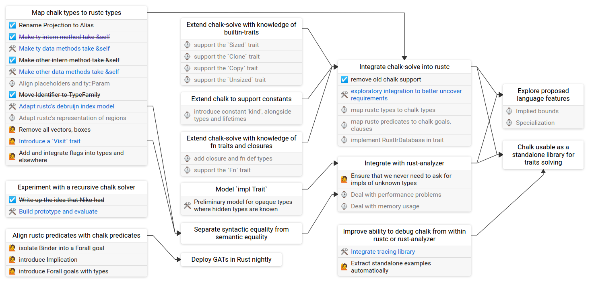

# skilltree

Re-implemented skill tree for the Rust #wg-traits working group.

This is implemented in TypeScript and uses a JSON file to load the data.

Eventually, this will support editing the data in the web browser.

